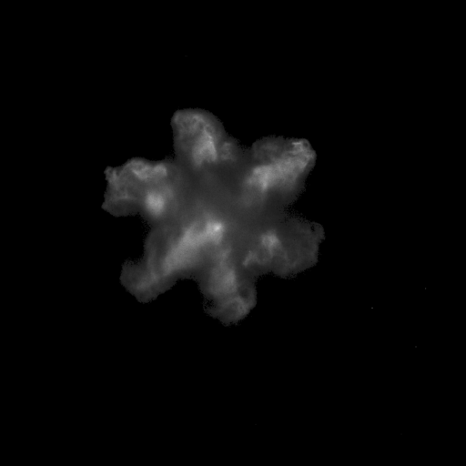
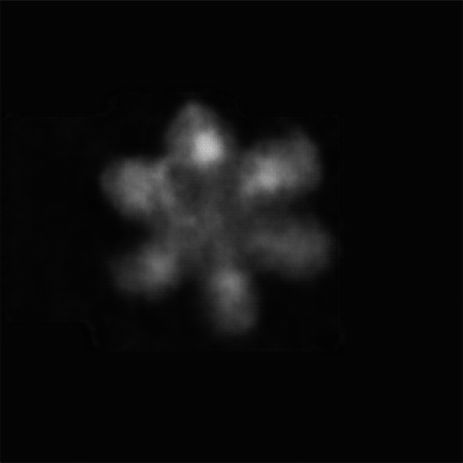

# Deep learning framework for multicomponent-spray-prediction
*Accepted by ASME ICEF 2024*

This repo presents a deep learning framework, the Encoder-LSTM-Decoder structure, for spray cross-pattern prediction from the work *"Prediction of Spray Collapse Patterns on Different Fuel Mixture Compositions Based on Deep Learning Framework"*. It is realized in Python. This work indicated that the proposed framework could efficiently capture the underlying correlations between varying fuel mixture compositions and their resultant spray patterns given certain environmental parameters. This predictive capability facilitates the identification of optimal mixture states for achieving superior fuel atomization quality.

The source code for our model training, predicting, and evaluating is published in this GitHub repo. The sample dataset is uploaded in this repo as well. If you are interested in further expanding our idea to other pattern datasets, please cite our coming paper.


## Repo Guidelines
The sample dataset, result, and the well-trained models are published but could be available on request.
### Sample Dataset
For both extrapolated and interpolated prediction, we use the **octane-fixed interpolation/extrapolation model** to demonstrate our work in this repo.
All the images in the dataset are of size (1, 768, 768) and have been thresholded.

- dataset/
  - sample_train/
    - extrapolation/
      - octane-fixed/
        - 1
        - 2
        - ... (288 folders, each containing 5 images)
    - interpolation/
      - octane-fixed/
        - 1
        - 2
        - ... (288 folders, each containing 3 images)
  - sample_test/
    - extrapolation/
      - octane-fixed/
        - 1
        - 2
        - ... (72 folders, each containing 5 images)
    - interpolation/
      - AEC-test-set-threshold
      - ACB-test-set-threshold
      - CED-test-set-threshold (each of these three folders contains 72 subfolders with 3 images)

| **Category** | **Item**                | **Value**            |              |
|--------------|-------------------------|----------------------|--------------|
| **Hyperparameters**| Batch Size        | 72                   |              |
|              | Learning Rate (lr)      | 0.001                |              |
|              | Epoch                   | 1000                 |              |
| **Dataset**  | All Samples (number of images)| 4320           |              |
|              | Training Set            | 80% (3456 in total)  |              |
|              | Test Set                | 20% (864 in total)   |              |
|              |                         | **Interpolation**    | **Extrapolation**  |
|              | Training Sequences      | 288                  | 288          |
|              | Test Sequences          | 72                   | 72           |
|              | Images in a Sequence    | 3                    | 5            |

**Note: we only publish the octane-fixed case in this repo. Other data including pentane-fixed and decane-fixed cases could be available on request. It is also encouraged to test the framework on other fuel mixture composition scenarios**

### Training
Training source code is arranged using Python:
```
python ./LSTM_training.py
```

### Prediction
Predicting source code is arranged using Python:
```
python ./predict.py
```

### Evaluation
The codes for evaluating the similarity of a test set and the accuracy of the result are arranged using Python:
```
python ./test_similarity.py
python ./test_accuracy.py
```

### Result
The results of the octane-fixed interpolated/extrapolated prediction are published in the folder *result*. For each prediction result, we present:
- Label images and output images (*.png)
- The plume-to-tip distance *d* of every spray pattern (d.txt)

### Citation

### Examples
./result/extrapolation/octane-fixed/label_image_43.png


./result/extrapolation/octane-fixed/output_image_43.png


[./result/extrapolation/octane-fixed/d.txt](./result/extrapolation/octane-fixed/d.txt)
